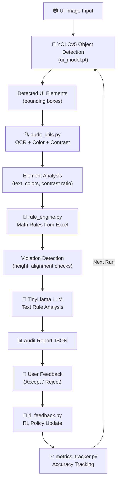

# 📊 Smart UI Auditor — Project Analysis & AI Model Integration Guide

## Table of Contents
1. [Current Application Flow](#current-application-flow)
2. [Frontend Architecture](#frontend-architecture)
3. [SMARTUI_RL AI Model Architecture](#smartui_rl-ai-model-architecture)
4. [Gap Analysis — What's Missing](#gap-analysis--whats-missing)
5. [Integration Plan — Connecting Frontend ↔ AI Model](#integration-plan--connecting-frontend--ai-model)
6. [Redux State Management Strategy](#redux-state-management-strategy)

---

## Current Application Flow

```
┌─────────────┐    ┌───────────────────┐    ┌─────────────────────────────────────┐    ┌──────────────┐
│  Upload     │───►│  Analysis         │───►│  Analysis Results                   │───►│  User        │
│  Page       │    │  Selection        │    │  (one of 3 paths)                   │    │  Testing     │
└─────────────┘    └───────────────────┘    └─────────────────────────────────────┘    └──────────────┘
│ - Drag & Drop    │ - Choose analysis      │ Path 1: Violet Rules                │ - Webcam + Screen
│ - URL Import     │   type                 │ Path 2: Element Interaction & Score  │ - Issue Detection
│ - Code Upload    │ - Preview uploaded     │ Path 3: Combined Analysis            │ - Export Report
│ - File progress  │   image                │                                      │
```

### Step-by-Step Flow

| Step | Page | Component | What Happens |
|------|------|-----------|--------------|
| 1 | **Upload** | `UploadPage.tsx` | User uploads image/file via drag-drop, file picker, or URL. File progress is simulated. Outputs `fileName` + `imageUrl`. |
| 2 | **Selection** | `AnalysisSelection.tsx` | User sees 3 radio options: *Rules*, *Elements*, or *All*. Shows uploaded image preview. |
| 3a | **Violet Rules** | `VioletRulesPage.tsx` | Shows 6 hardcoded UI heuristic rules (Visual Hierarchy, Contrast, Proximity, etc.). User confirms/denies each violation. Shows accuracy %. |
| 3b | **Element Score** | `ElementInteraction.tsx` | Shows annotated screenshot with red bounding boxes. Per-element scores (buttons: 70%, inputs: 40%, etc.). All data is **hardcoded**. |
| 3c | **Combined** | `CombinedAnalysis.tsx` | Merged view: violation rules + element scores + before/after comparison. AI suggestions are **hardcoded strings**. |
| 4 | **User Testing** | `UserTesting.tsx` | Screen + webcam recording. Post-session: issue cards, severity levels, emotion detection. Uses Electron `desktopCapturer` API. |

> [!WARNING]
> **All analysis data is currently hardcoded/mock.** No component connects to the SMARTUI_RL AI model. The "Processing" spinners are purely decorative `setTimeout()` delays.

---

## Frontend Architecture

```
App.tsx (Root — manages navigation via useState<AppStep>)
 ├── State: step, uploadedFile, uploadedImageUrl
 ├── UploadPage           → onProcess(fileName, imageUrl)
 ├── AnalysisSelection    → onStartAnalysis('rules' | 'elements' | 'all')
 ├── VioletRulesPage      → displays hardcoded rules
 ├── ElementInteraction   → displays hardcoded element scores
 ├── CombinedAnalysis     → displays hardcoded violation + suggestion data
 └── UserTesting          → webcam/screen recording via Electron IPC
```

**State Management:** All state lives in `App.tsx` via `useState`. Data is passed through props (prop drilling). There is **no global state management** (no Redux, Context, or Zustand).

**Electron Layer:**
- `app/main.js` — Creates `BrowserWindow`, handles IPC for `get-sources` (screen capture) and `get-app-info`
- `app/preload.js` — Exposes `electronAPI.getSources()` and `electronAPI.getAppInfo()` to the renderer

---

## SMARTUI_RL AI Model Architecture

The AI model is a **Python-based** pipeline located in `SMARTUI_RL/`. It consists of 4 modules + 2 model files:



### Module Breakdown

#### 1. `ui_model.pt` — YOLOv5 Object Detection Model (51 MB)
- **Purpose:** Detects UI elements (buttons, inputs, navigation, cards, etc.) in uploaded screenshots
- **Output:** Bounding boxes `[x1, y1, x2, y2]` for each detected element
- **Framework:** PyTorch (YOLOv5)

#### 2. `audit_utils.py` — Element Content Analysis
| Function | What it Does |
|----------|-------------|
| `get_contrast_ratio(color1, color2)` | WCAG 2.1 contrast ratio formula between two RGB colors |
| `analyze_element_content(img_crop)` | For each detected element: runs **EasyOCR** to extract text, uses **K-Means clustering** to find dominant foreground/background colors, calculates contrast ratio |

#### 3. `rule_engine.py` — Design Rule Evaluation
- Loads rules from `UI_RULE_SETS.xlsx` spreadsheet
- Supports profiles: `apple`, `google`, `android`, `microsoft`, `healthcare`, `ecommerce`, `gaming`, `enterprise`, `web`, `universal`
- **Math Rules:** `min_button_height` (44px), `min_field_height` (40px), `max_misalignment` (4px)
- **Text Rules:** Extracts compliance/safety text rules for LLM context (e.g., HIPAA)
- Defaults used as safety net when Excel has no numeric values

#### 4. `rl_feedback.py` — Reinforcement Learning Feedback
- Stores per-rule "strictness weights" in `rl_memory.json`
- **Positive feedback (+1):** Rule weight increases → model enforces more strictly
- **Negative feedback (-1):** Rule weight decreases → model learns to ignore
- Weight clamped between 0.0 (always ignore) and 2.0 (super strict)
- Learning rate: 0.2
- If weight < 0.4, the rule is automatically suppressed

#### 5. `metrics_tracker.py` — Accuracy Tracking
- Tracks violations detected vs. accepted/rejected per run
- Calculates false positive rate and accuracy %
- Shows improvement metrics across multiple runs

#### 6. `tinyllama-1.1b-chat-v1.0.Q4_K_M.gguf` — TinyLlama LLM (669 MB)
- **Purpose:** Generates text-based analysis for rules that can't be evaluated mathematically (e.g., "Does this UI follow visual hierarchy?", "Is the layout HIPAA compliant?")
- **Format:** GGUF quantized model (runs locally via `llama-cpp-python`)

### Sample Output (`audit_result.json`)

```json
{
    "meta": { "timestamp": "...", "profile": "universal" },
    "summary": { "score": 95, "violations": 1 },
    "elements": [
        {
            "id": 0,
            "type": "detected_object",
            "bbox": [330, 312, 591, 422],
            "content": {
                "text": "Files Document upload...",
                "contrast": 2.47,
                "bg_color": [251, 251, 251],
                "fg_color": [162, 161, 165]
            },
            "issues": [{ "rule": "min_height", "desc": "Height 110px < 200px" }],
            "status": "FAIL"
        }
    ]
}
```

---

## Gap Analysis — What's Missing

| Area | Current State | What's Needed |
|------|--------------|---------------|
| **Image persistence** | `URL.createObjectURL()` creates a blob URL, lost on navigation | Store image binary/base64 in Redux store, persist across pages |
| **AI Model connection** | Frontend shows mock data | Python backend API (Flask/FastAPI) serving the AI model, or Electron IPC bridge to spawn Python |
| **Rule results** | Hardcoded 6 rules in `VioletRulesPage.tsx` | Real results from `rule_engine.py` + `audit_utils.py` |
| **Element scores** | Hardcoded scores in `ElementInteraction.tsx` | Real bounding boxes + scores from YOLOv5 detection |
| **Combined analysis** | Hardcoded suggestions | Real combined output from all modules |
| **User feedback loop** | Modal asks Yes/No but does nothing | Connect to `rl_feedback.py` to update policy weights |
| **Accuracy tracking** | Shows hardcoded 33% | Real metrics from `metrics_tracker.py` |
| **LLM suggestions** | Hardcoded strings | Real TinyLlama inference for text-based rules |

---

## Integration Plan — Connecting Frontend ↔ AI Model

### Architecture Options

#### Option A: Python Backend API (Recommended)
```
┌──────────────────────┐     HTTP/REST      ┌─────────────────────────┐
│  Electron + React    │ ◄──────────────►   │  Flask/FastAPI Server   │
│  (Frontend)          │                     │  (SMARTUI_RL)           │
│                      │  POST /analyze      │  - YOLOv5 inference     │
│  Redux Store         │  POST /feedback     │  - OCR + Contrast       │
│  - uploaded images   │  GET  /metrics      │  - Rule Engine          │
│  - analysis results  │                     │  - RL Feedback          │
│  - user feedback     │                     │  - TinyLlama LLM        │
└──────────────────────┘                     └─────────────────────────┘
```

**Required API Endpoints:**

| Endpoint | Method | Request | Response |
|----------|--------|---------|----------|
| `/analyze` | POST | `{ image: base64, profile: "healthcare" }` | `audit_result.json` format |
| `/feedback` | POST | `{ profile, rule_name, feedback: +1/-1 }` | Updated weight |
| `/metrics` | GET | — | Accuracy & improvement metrics |
| `/rules/profiles` | GET | — | List of available rule profiles |

#### Option B: Electron IPC + Python Child Process
- Spawn Python process from Electron main process via `child_process`
- Communicate via stdin/stdout or local socket
- Pros: No separate server needed
- Cons: More complex process management, harder to debug

### Recommended: Option A with FastAPI

---

## Redux State Management Strategy

### Why Redux is Needed Here

1. **Image data must persist** from Upload → Analysis Selection → Analysis Results
2. **Analysis results** need to be accessible across multiple pages (Rules, Elements, Combined)
3. **User feedback** needs to accumulate and be sent to the RL model
4. **Multiple data flows** intersect (upload + profile + results + feedback)

### Proposed Redux Store Shape

```typescript
interface RootState {
  upload: {
    file: File | null
    fileName: string | null
    imageBase64: string | null      // Persisted image data
    imageUrl: string | null         // Object URL for preview
    uploadProgress: number
    category: string                // web, mobile, dashboard, ecommerce
  }
  analysis: {
    selectedType: 'rules' | 'elements' | 'all'
    isLoading: boolean
    error: string | null
    auditResult: AuditResult | null // Full result from AI model
    elements: DetectedElement[]     // Parsed element data
    violations: Violation[]         // Parsed violation data
    overallScore: number
    accuracy: number
  }
  feedback: {
    responses: Record<number, 'accepted' | 'rejected'>  // elementId → response
    rlWeights: Record<string, number>                     // From rl_memory.json
  }
  metrics: {
    runs: RunData[]
    improvement: ImprovementMetrics | null
  }
}
```

### Redux Slices

| Slice | File | Manages |
|-------|------|---------|
| `uploadSlice` | `src/store/uploadSlice.ts` | File data, image persistence, category, progress |
| `analysisSlice` | `src/store/analysisSlice.ts` | Analysis type, loading state, AI model results |
| `feedbackSlice` | `src/store/feedbackSlice.ts` | User accept/reject responses, RL weight updates |
| `metricsSlice` | `src/store/metricsSlice.ts` | Run history, accuracy tracking |

### Data Flow with Redux

```
User uploads image
  └─► dispatch(setUploadedFile({ file, base64, url }))
        └─► Redux persists image across navigation

User selects analysis type & clicks "Start"
  └─► dispatch(startAnalysis({ type, imageBase64, profile }))
        └─► Redux Thunk → POST /analyze → API response
              └─► dispatch(setAuditResult(response))

VioletRulesPage reads from store
  └─► useSelector(state => state.analysis.violations)

User clicks "Yes/No" on violation
  └─► dispatch(submitFeedback({ elementId, feedback }))
        └─► Redux Thunk → POST /feedback → Updated weight
              └─► dispatch(updateRlWeight({ rule, weight }))
```

---

> [!IMPORTANT]
> **Next Steps (in order):**
> 1. Install Redux Toolkit (`@reduxjs/toolkit`, `react-redux`)
> 2. Create the Redux store with slices for upload, analysis, feedback, metrics
> 3. Create a FastAPI backend wrapper around the SMARTUI_RL modules
> 4. Replace hardcoded data in each page with `useSelector` / `useDispatch`
> 5. Connect the "Processing" spinners to actual API calls via Redux Thunks
> 6. Wire the RL feedback modal to real policy updates
